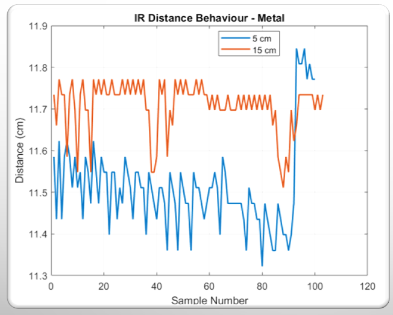
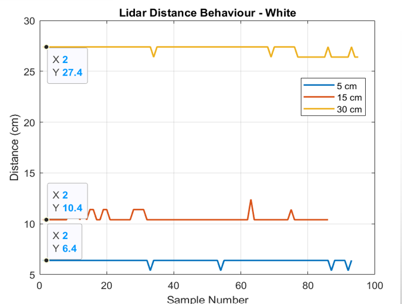
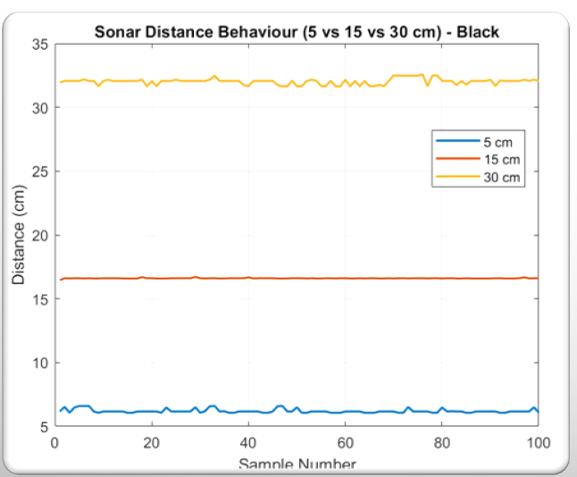
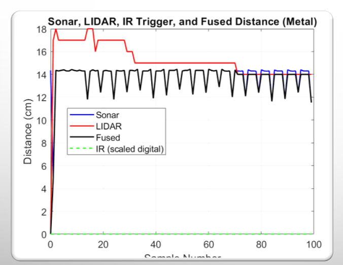
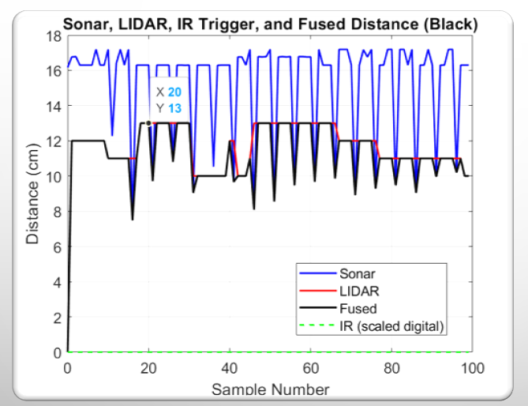
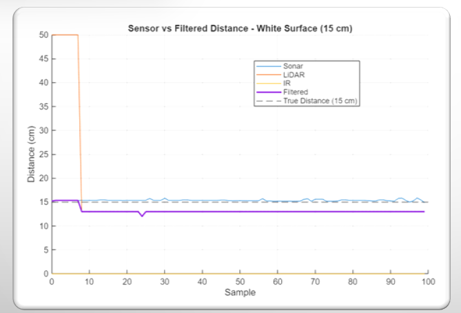
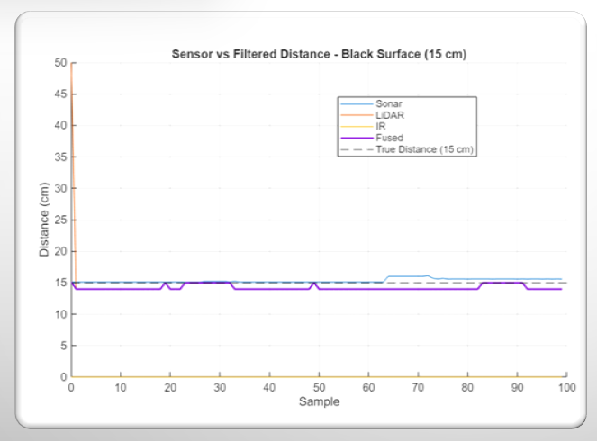
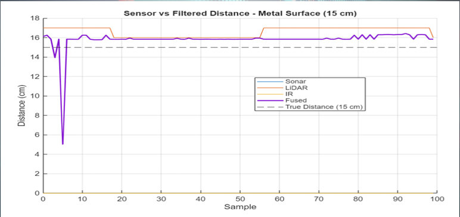
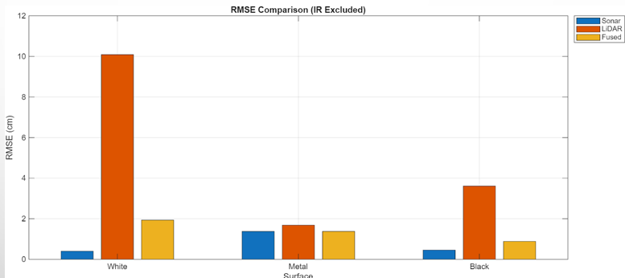

# Results & Interpretation

This section explains the main behaviours observed and how fusion + filtering improved usability.

## LiDAR (ToF) behaviour
**White cardboard**
- Generally stable at all tested distances
- Best-case surface for ToF due to strong diffuse return

**Metal**
- Usable but can show spikes/dropouts depending on angle (specular reflections)
- Sensitive to orientation changes

**Black cloth**
- Frequent dropouts and jumps (low NIR reflectivity)
- In some runs, LiDAR effectively becomes “blind” → unreliable

## Sonar behaviour
- Stable across all surfaces compared to LiDAR on black cloth
- Minor jitter from geometry/roughness/echo artefacts
- Strong baseline sensor for short range when optics degrade

## IR behaviour
- Analogue output did not reliably vary across 1–30 cm in this build
- Repurposed as digital trigger for obstacle presence

---

## Weighted fusion: what it achieved
- Prevented catastrophic failures by down-weighting unstable sensor streams.
- On black cloth, fusion becomes sonar-dominant when LiDAR variance increases.
- On metal/white, fusion settles between sensors.

### When fusion can look “worse” (RMSE case)
Fusion can produce higher RMSE when:
- Both sensors share similar bias (systematic error is not cancelled)
- Weighting does not reflect true reliability for that surface/range
- A sensor intermittently spikes and the weighting/windowing doesn’t suppress it quickly enough

---

## Kalman filtering: why it helped
- Reduced short-term noise in the fused output
- Suppressed startup spikes (common with ToF initial acquisition)
- Produced a stable signal for threshold-based RGB logic

---

## Figures
# raw sensor fusion

# weighted fusion comparison

# kalman fusion

# rmse comparison
  

# variance comparison
  

